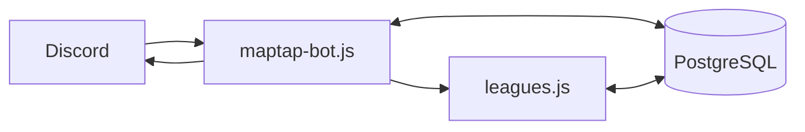
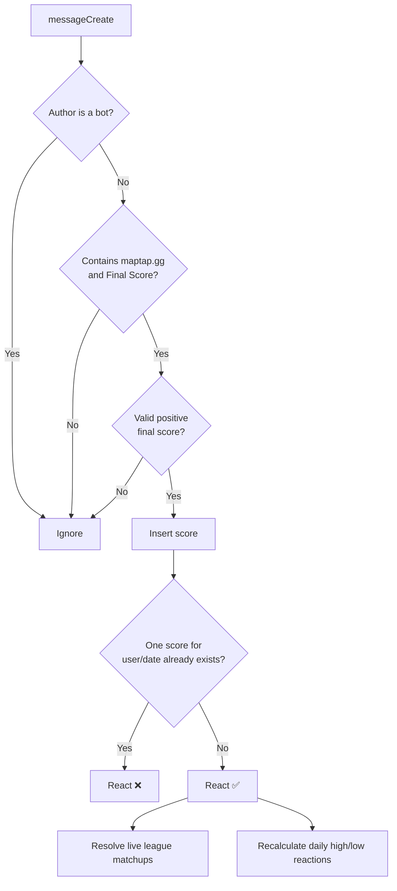
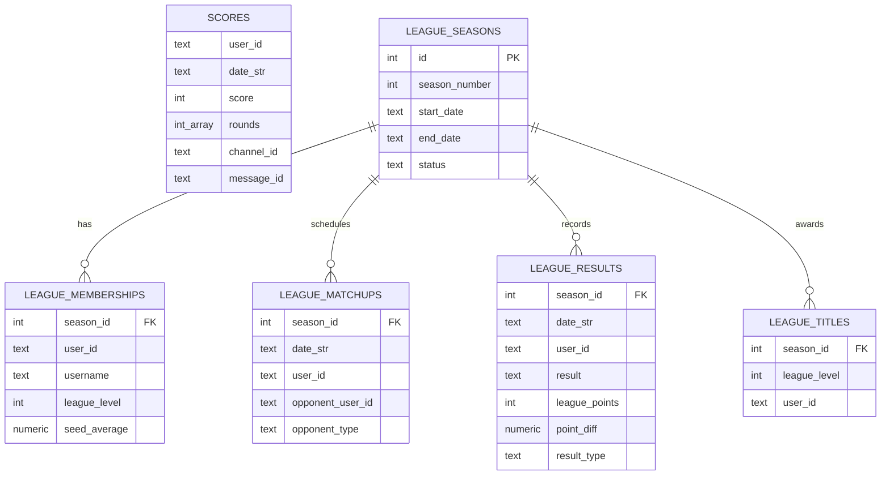

# MapTap Bot: Architecture and Runtime Flow

## Purpose

MapTap Bot records daily MapTap scores posted in Discord, maintains daily and
all-time statistics, and runs a three-division league alongside the daily game.
It is a single Node.js process backed by PostgreSQL and Discord.

## Components

| Component | Responsibility |
| --- | --- |
| `maptap-bot.js` | Application entry point, Discord event handlers, commands, daily jobs, score recap logic, and core tables. |
| `leagues.js` | League schema, season lifecycle, scheduling, matchup resolution, standings, and league message formatting. |
| PostgreSQL | Durable score history, idempotency state, league state, schedules, and results. |
| Discord | Input surface (score posts and commands) and output surface (reactions, embeds, reminders, and league posts). |
| `scrape-history.js` | One-time importer for `maptap-scores.json`. |
| `export-scores.js` | CSV export of the `scores` table. |

## Startup

The process requires `DISCORD_TOKEN`, `ANNOUNCE_CHANNEL_ID`, and
`DATABASE_URL`; `GUILD_ID` is optional and scopes slash-command registration to
one guild for immediate availability.

On startup, the bot:

1. Creates the core score/idempotency tables.
2. Creates the league tables.
3. Ensures that a league season exists for the current Eastern-time date.
4. Logs in to Discord.
5. Registers `/maptap`, `/mystats`, and `/leagues` when Discord emits `ready`.

## Message intake

The bot subscribes to guild, guild-message, and message-content intents. It
receives `messageCreate` events for every server channel it can view; there is
no score-input channel allowlist. `ANNOUNCE_CHANNEL_ID` is only the destination
for scheduled output.

### Score parsing and persistence

A qualifying message supplies a `Final Score` and may contain up to five round
scores preceding it. The bot stores the score, parsed round values, author ID
and current username, Eastern-time date, and source channel/message IDs. The
`scores` unique constraint on `(user_id, date_str)` makes a second submission
from the same user on the same day a duplicate.

After a successful insert, the bot:

- updates the active league membership with the author's current username;
- attempts to settle any completed head-to-head or league-average matchup;
- adds win/loss reactions when a matchup has resolved; and
- moves the Dunce reaction to the day's lowest submitted score(s) and the nerd
  reaction to the day's highest submitted score(s).

## Commands

| Command | Visibility | Behavior |
| --- | --- | --- |
| `/maptap` | Channel reply | Builds the current-day score recap embed. |
| `/mystats` | Ephemeral | Shows the invoking user's score, placement, medal, and round statistics. |
| `/leagues` | Ephemeral by default | Shows a live current-day league snapshot: settled results, tables, and still-to-play matchups. |
| `/leagues post:true` | Public, managers only | Posts the same league snapshot in the command channel. |

## Scheduled work

All scheduled jobs use `America/New_York`, and all use database state as an
idempotency guard.

| Time | Job | Output/state change |
| --- | --- | --- |
| 9:00 PM | League reminder | Mentions scheduled league players without a score for the day. |
| 12:00 AM | Daily recap | Posts an embed for yesterday's MapTap scores and all-time summaries. |
| 12:01 AM | League closeout | Finalizes yesterday's league matchups, posts results/tables/titles/next matchups, applies reactions, and records the posted date. |

The closeout makes exactly one call to `buildDailyLeagueMessages`. Season
rollover itself finalizes the preceding final day before it calculates standings,
so no preliminary duplicate build is necessary.

## Data relationships

