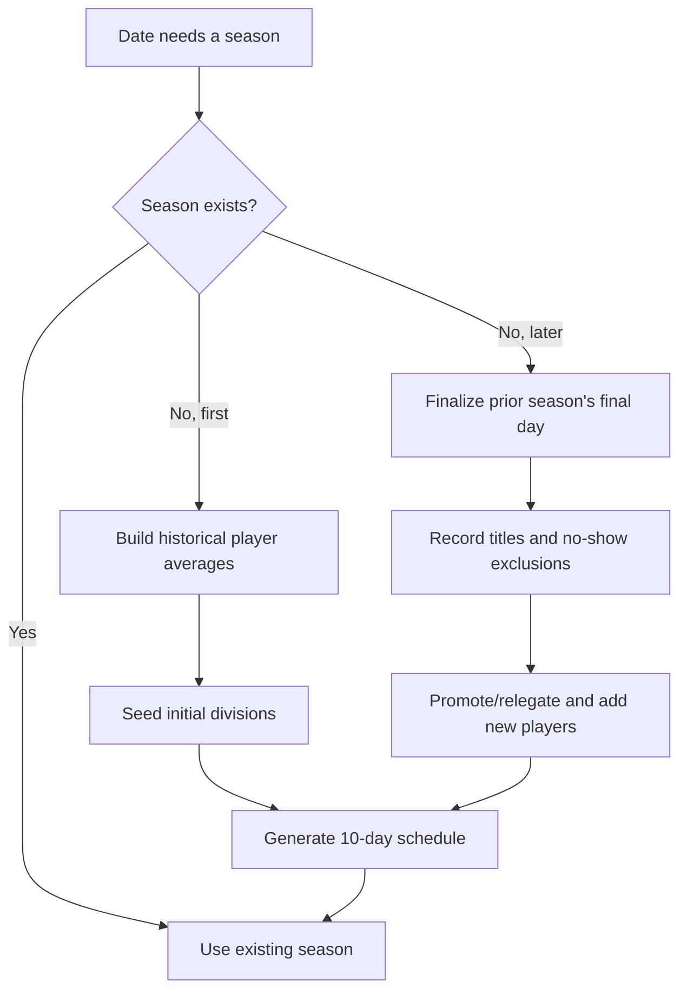
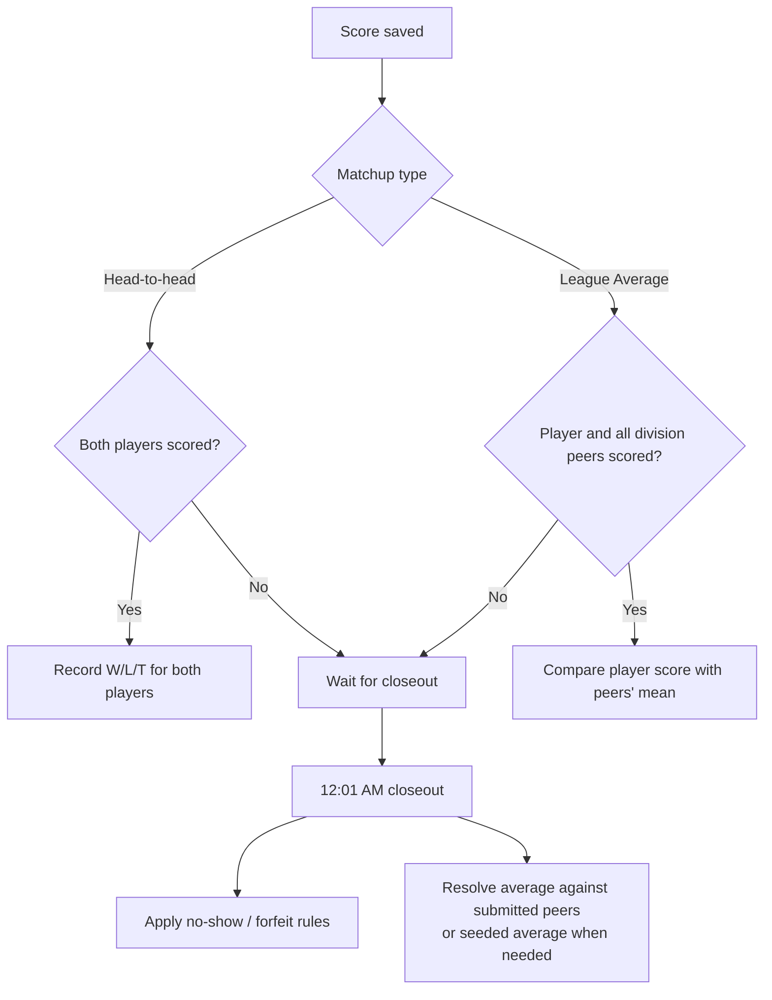

# MapTap League: Lifecycle and Operations

## Season model

The league begins on 2026-06-29 and runs in consecutive ten-day seasons. It
has three divisions:

1. League Tism
2. League Mid
3. League Dunce

Each season has a membership snapshot and a generated schedule. This keeps
historical standings and results independent from later roster changes.

## Initial seeding

For the first season, scores before the start date are used to calculate each
player's historical average and number of games in the prior 30 days.

- Players with at least ten games in that period are eligible for the initial
  top divisions.
- The five best eligible averages enter League Tism; the next five enter League
  Mid.
- Everyone else enters League Dunce.
- Explicit exclusions and players recorded in `league_exclusions` are omitted.

## Schedule generation

Each division gets a round-robin schedule. An odd number of players adds a
bye-like matchup against `League Average`; an even number produces only
head-to-head matchups.

The season is longer than some round-robin cycles. Complete cycles are
scheduled first, then leftover rematches are spread evenly through the cycle so
the earliest matchups are not replayed disproportionately.

## Result resolution

Standard outcomes award three points for a win, one for a tie, and zero for a
loss. Standings sort by league points, total score, point differential, seed
average, then username.

At closeout:

- both absent head-to-head players receive a double-no-show loss;
- one absent head-to-head player forfeits to the submitting player;
- an absent League Average player receives a no-show loss; and
- a League Average player's opponent is the mean of submitted division peers,
  falling back to the peers' seed average if no peer submitted.

Resolved wins and losses may receive `🇼` and `🇱` reactions on the originating
score messages. Ties do not receive a result reaction.

## Rollover

Before creating a later season, the bot calls `finalizeLeagueDate` for the
previous season's last day. Only then does it calculate final standings, award
division titles, identify no-show exclusions, and create the next roster. This
ordering is important because rollover can be reached from startup, score
submission, `/leagues`, or the nightly job.

Normal rollover promotes the first-place player from each lower division and
relegates the last-place player from each adjacent upper division. Newly eligible
players join League Dunce.

There is also a one-time expansion after Season 3: two League Mid players move
to League Tism, three League Dunce players move to League Mid, and the last
place players in Leagues Tism and Mid move down one division.

Players with at least seven no-show-related results in a season are added to
`league_exclusions` and are not placed in later seasons.

## League output

The nightly league post separates yesterday's outcome from today's play:

- primary message: yesterday's Results and Tables;
- secondary message: historical Titles and today's Matchups;
- final-season-day post: labels the first message as Final Standings and adds a
  season awards panel.

`/leagues` is intentionally different: it is a live snapshot for today. It
shows matchups already settled under Results and only unresolved matchups under
Still to play; it omits the historical Titles section.

## Operational checks

- Run `node test-leagues.js` after changing scheduling, standings, message
  formatting, or rollover code.
- Use `DATABASE_URL='…' node export-scores.js [output.csv]` to export score
  history.
- Run `scrape-history.js` only as a one-time historical import; its inserts are
  idempotent for existing `(user_id, date_str)` score rows.
